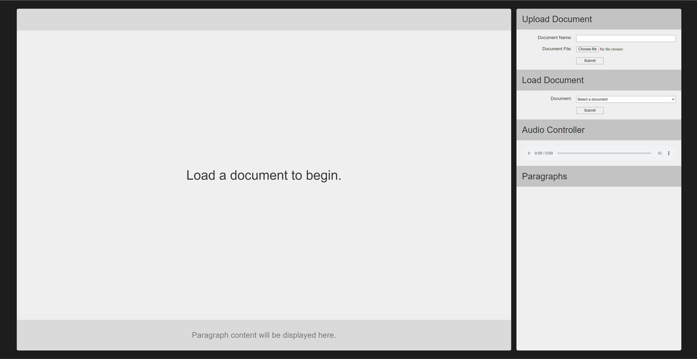
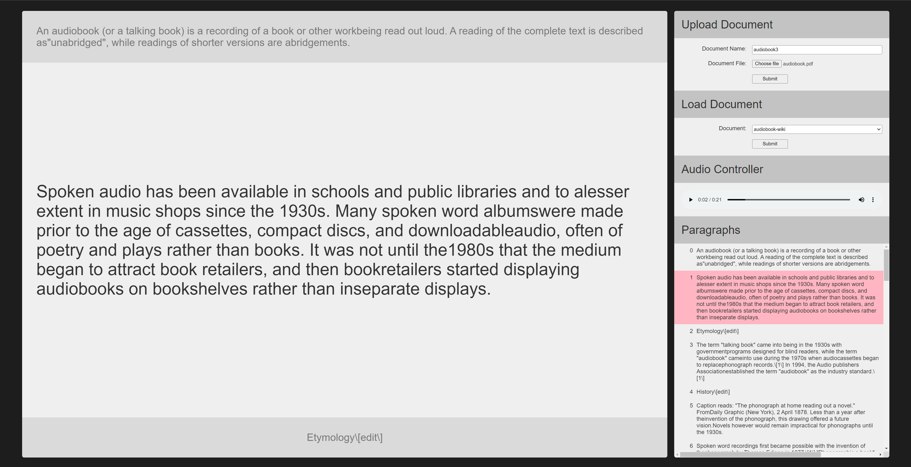

# document-to-tts

Convert a document to text-to-speech audio files. A web console is provided to upload documents and listen to the audio files.

## Usage

Split the text into paragraphs and sentences. The script will then convert each sentence into an audio file.

### Web console

```bash
cd web
make
mkdir documents
make start
```




### Split text

```bash
./split-document.sh --output-dir <output_dir> <input_file>
```

Example:

```bash
./split-document.sh --output-dir txt-split -- ./my_poetry.docx
```

### Convert split text to audio

```bash
python3 split-txt-to-tts.py --text-dir <input_dir> --output-dir <output_dir>
```

Example:

```bash
python3 split-txt-to-tts.py --text-dir txt-split --output-dir audio-split
```

